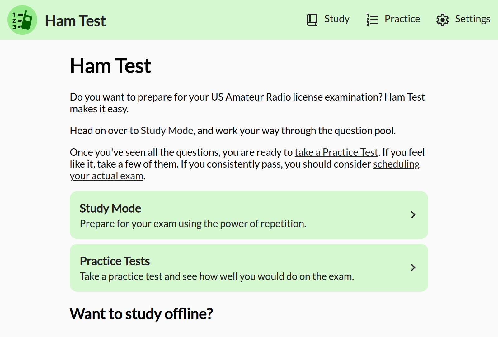
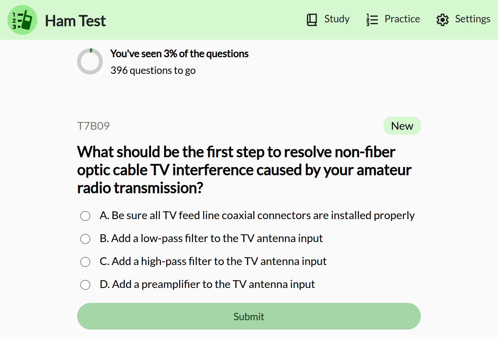
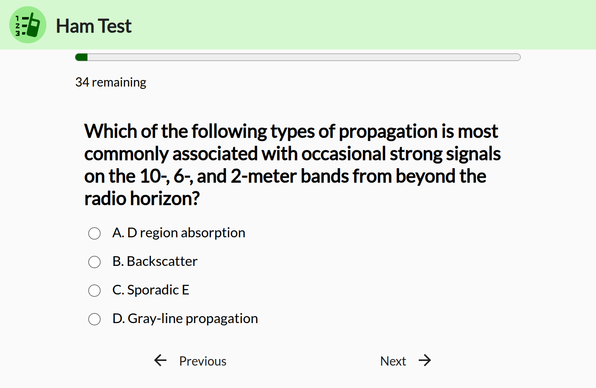
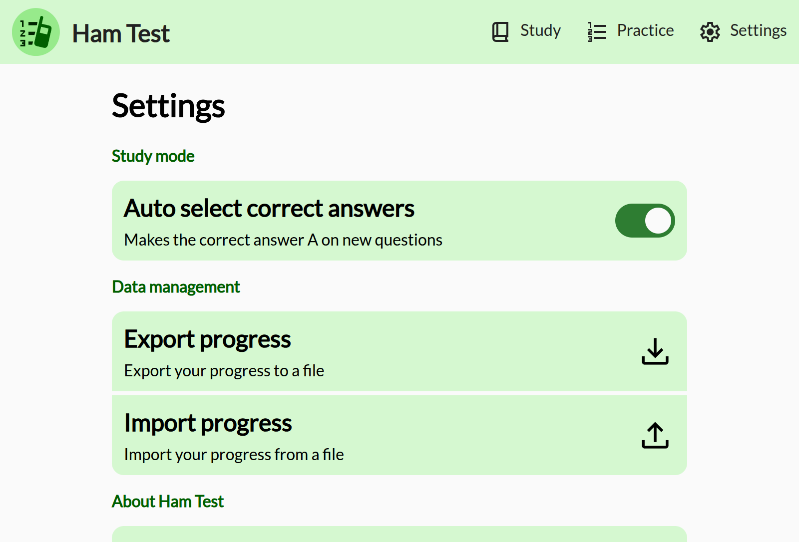

# Ham Test

A simple, easy to use app to prepare you to take all three US amateur radio tests.

Try it out at https://hamtest.web.app

## Want to study offline?

You can use Ham Test's Android app, completely offline with no internet access at all!

Best of all, you can import and export your progress through the settings, making it easy to switch between devices.

 
 

## Features

 - Study mode featuring repetitive questions to make you remember the correct answers
 - Practice mode, which gives you a practice test that will accurately assess how well you're doing as the questions are identical as how they would appear on the test

## Explanations

I'm trying to get explanations for all of the questions in all three of the pools. If you're interested in helping out, check out [the question pools repo](https://github.com/DubsterDev/HamTestQuestionPools).

## Included question pool effective dates

The **Technician** question pool is valid through **2026-2030**.

The **General** question pool is valid through **2023-2027**.

The **Amateur Extra** question pool is valid through **2024-2028**.

 ## Screenshots

